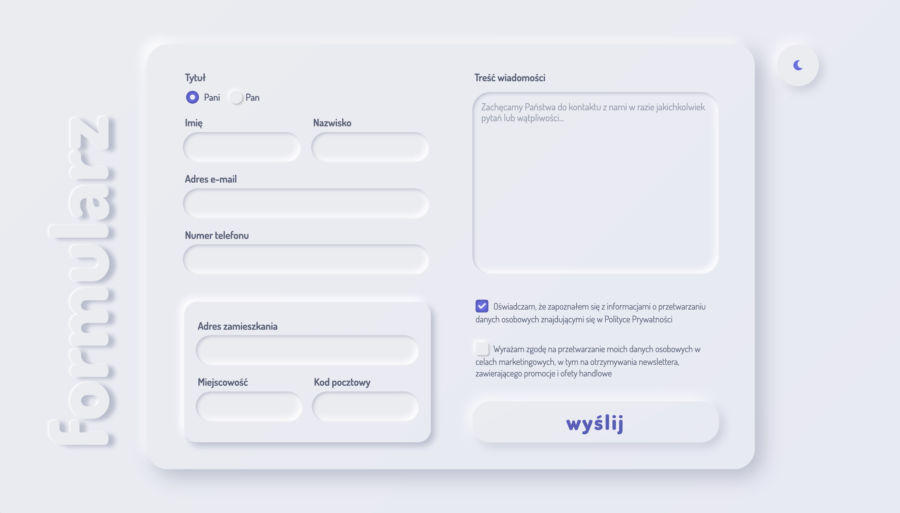
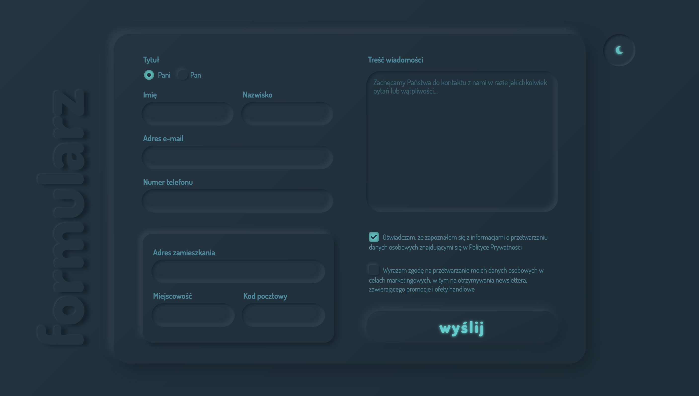

 

# Neumorphic form
 

## General info
Simple form created for "WTF: co ten frontend" training program - with my own neumorphic design in both light mode and dark mode.

## Live view
Link: https://nenyancodes.github.io/WTF-form/

## Poject status

## TODO
* [ ] add REGEX paterns to inputs
* [ ] add animation to modes toggle
* [ ] change font family of labels

## Contact
Created by Anna Wójtowicz alias __@nenyancodes__ - feel free to contact me here on [GitHub](https://github.com/nenyancodes). 
  You can also find me on [Twitter](https://twitter.com/nenyancodes).

 
 

